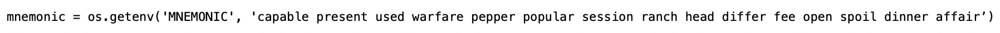
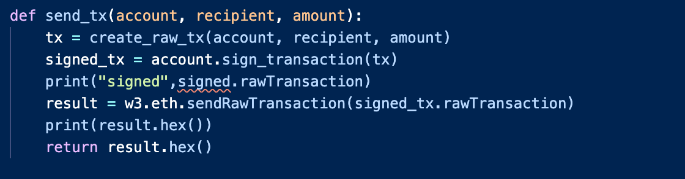

# hw19-Multi-Blockchain Wallet in Python


## 2/ Generate genesis block.

### 2.1/  Genesis block
* `puppeth`, to configure a new genesis block.
* `Proof of Authority` as consensus algorithm.
* Accounts to seal
    * Public address:   0xffC0Ad3829628146669CC43429bd071A5B8f6644
    * Public address:   0xA511dc7ece42633e5B97C7d16c05629191F20ea7
* Accounts to pre-fund.
    * Public address:   0xffC0Ad3829628146669CC43429bd071A5B8f6644
    * Public address:   0xA511dc7ece42633e5B97C7d16c05629191F20ea7


## 1/ Create accounts for two nodes for the network —> node1 + node2

### 1.1/ node1
* Public address:   0xffC0Ad3829628146669CC43429bd071A5B8f6644


### 1.2/ node2
* Public address:   0xA511dc7ece42633e5B97C7d16c05629191F20ea7


## 0/ Dependencies

- PHP must be installed on the operating system 

- You will need to clone the [`hd-wallet-derive`](https://github.com/dan-da/hd-wallet-derive) tool.

- [`bit`](https://ofek.github.io/bit/) Python Bitcoin library.

- [`web3.py`](https://github.com/ethereum/web3.py) Python Ethereum library.


## 1/ Project setup

- 1.1/  Create a project directory called `wallet` and `cd` into it.


- 1.2/ Clone the hd-wallet-derive tool into this folder


- 1.3/ Create a symlink called derive for the hd-wallet-derive/hd-wallet-derive.php script into the top level project
directory like so: ln -s hd-wallet-derive/hd-wallet-derive.php derive


  This will clean up the command needed to run the script in our code, as we can call `./derive`
  instead of `./hd-wallet-derive/hd-wallet-derive.php`.

- 1.4/ Test that you can run the ./derive script properly


- 1.5/ Create a file called wallet.py -- this will be your universal wallet script. 


- 1.6/ Directory tree 


## 2/ Setup constants

2.1/ Setup constants
constants.py


- In `wallet.py`, import all constants: `from constants import *`

- Use these anytime you reference these strings, both in function calls, and in setting object keys.

## 3/ Generate a Mnemonic

- 3.1/ Generate a new 12 word mnemonic using `hd-wallet-derive` or by using [this tool](https://iancoleman.io/bip39/).


- 3.2/ Set this mnemonic as an environment variable


## 4/ Deriving the wallet keys

- 4.1/ Deriving BTC


- 4.1/ Deriving ETH


### 5/ functions 
- 5.1/ Imports


- 5.2/ Derive BTC


- 5.3/ Derive ETH


### 6/ Send some transactions
- 6.1/ Create transaction


- 6.2/ Send transaction


### 7/ Main
- 7.1/ Main


- 7.2/ Results


+++++++++++++++


Now, you should be able to fund these wallets using testnet faucets. Open up a new terminal window inside of `wallet`,
then run `python`. Within the Python shell, run `from wallet import *` -- you can now access the functions interactively.
You'll need to set the account with  `priv_key_to_account` and use `send_tx` to send transactions.

#### Bitcoin Testnet transaction

- Fund a `BTCTEST` address using [this testnet faucet](https://testnet-faucet.mempool.co/).

- Use a [block explorer](https://tbtc.bitaps.com/) to watch transactions on the address.

- Send a transaction to another testnet address (either one of your own, or the faucet's).

- Screenshot the confirmation of the transaction like so:


#### Local PoA Ethereum transaction

- Add one of the `ETH` addresses to the pre-allocated accounts in your `networkname.json`.

- Delete the `geth` folder in each node, then re-initialize using `geth --datadir nodeX init networkname.json`.
  This will create a new chain, and will pre-fund the new account.

- [Add the following middleware](https://web3py.readthedocs.io/en/stable/middleware.html#geth-style-proof-of-authority)
  to `web3.py` to support the PoA algorithm:

```
from web3.middleware import geth_poa_middleware

w3.middleware_onion.inject(geth_poa_middleware, layer=0)
```

- Due to a bug in `web3.py`, you will need to send a transaction or two with MyCrypto first, since the
  `w3.eth.generateGasPrice()` function does not work with an empty chain. You can use one of the `ETH` address `privkey`,
  or one of the `node` keystore files.

- Send a transaction from the pre-funded address within the wallet to another, then copy the `txid` into
  MyCrypto's TX Status, and screenshot the successful transaction like so:


### Submission

- Create a `README.md` that contains the test transaction screenshots, as well as the code used to send them.
  Pair the screenshot with the line(s) of code.

- Write a short description about what the wallet does, what is is built with, and how to use it.

- Include installing pip dependencies using `requirements.txt`, as well as cloning and installing `hd-wallet-derive`.
  You may include the `hd-wallet-derive` folder in your repo, but still include the install instructions. You do not
  need to include Python or PHP installation instructions.

- Upload the project to a new GitHub repository.

- Celebrate the fact that you now have an incredibly powerful wallet that you can expand to hundreds of coins!

### Challenge Mode

- Add support for `BTC`.

- Add support for `LTC` using the sister library, [`lit`](https://github.com/blockterms/lit).

- Add a function to track transaction status by `txid`.
